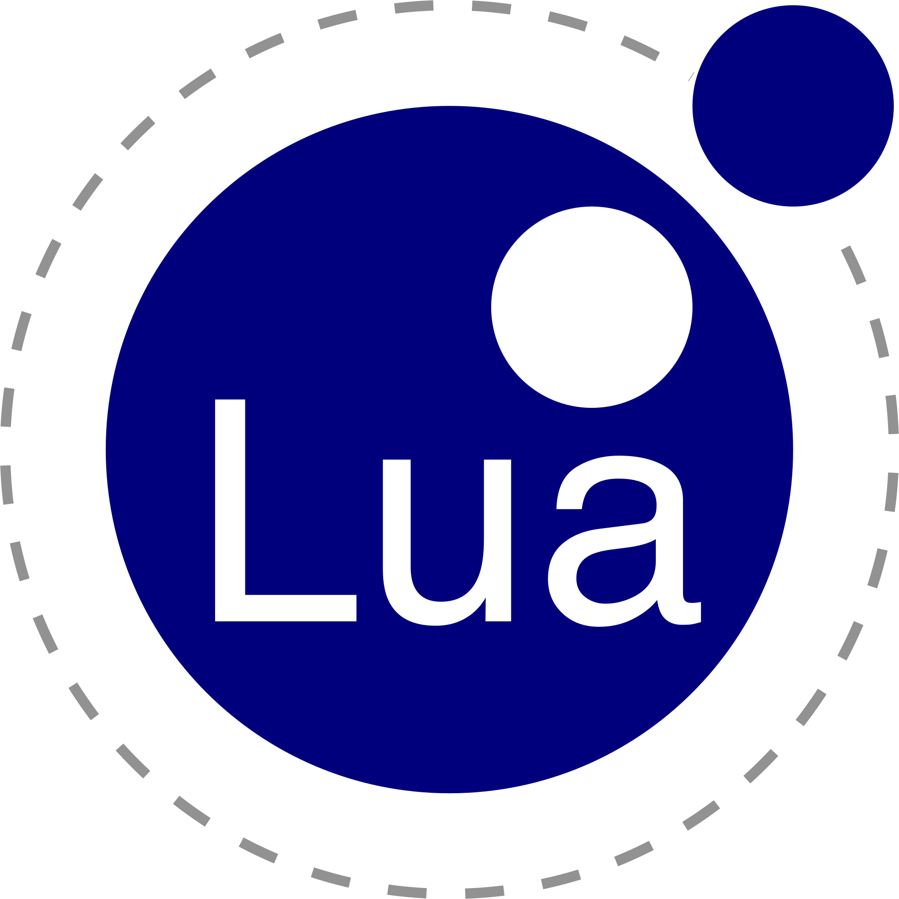

<p align="center">
  <a href="https://www.junityz.com"></a>
</p>


<h1 align="center">Hi, I'm <a href="https://www.edisonlee55.com">Linkang(Junity) Zhan</a>!</h1>
<h1 align="center">Welcome to my GitHub profile~ OwO</h1>
<h1 align="center"><-Please Click Left Button to Follow Me! QAQ</h1>


# 📕 ❀ Languages ❀

<code></code>
<code></code>
<code></code>
<code></code>
<code></code>
<code></code>
<code></code>

<p align="center">
  <strong><a href="https://www.junityz.com">Official Website</a></strong> |
  <strong><a href="https://www.linkedin.com/in/LinkangZhan">LinkedIn</a></strong> |
  <strong><a href="https://huggingface.co/Junity">HuggingFace</a></strong>
</p>

<p align="center">❤ I'm currently building a startup, and we are hiring, welcome to yomio.ai.</p>

------

### Visitor Counts:


# 📞 ❅ Contact ❅

```text
Email: junity@yomio.ai
Github: @JunityZhan
```
